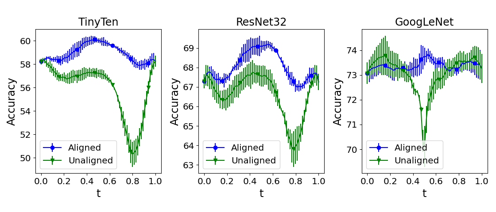

# (Optimizing Mode Connectivity via) NeuronAlignment



This repo contains the official code for *Optimizing Mode Connectivity via Neuron Alignment (2020)* by *N.J. Tatro et al.* 
This code is used 
for learning a curve on the loss surface between two neural networks that minimizes the average loss along the curve, 
where the models are connected up to a permutation of their weights. This includes methods for training networks, 
computing the neuron alignment between a network pair, and learning the curve between the networks up to a weight 
symmetry.

## Abstract
*The loss landscapes of deep neural networks are not well understood due to their high nonconvexity. Empirically, the 
local minima of these loss functions can be connected by a learned curve in model space, along which the loss remains 
nearly constant; a feature known as mode connectivity. Yet, current curve finding algorithms do not consider the 
influence of symmetry in the loss surface created by model weight permutations. We propose a more general framework to 
investigate the effect of symmetry on landscape connectivity by accounting for the weight permutations of the networks 
being connected. To approximate the optimal permutation, we introduce an inexpensive heuristic referred to as neuron 
alignment. Neuron alignment promotes similarity between the distribution of intermediate activations of models along the
curve. We provide theoretical analysis establishing the benefit of alignment to mode connectivity based on this simple 
heuristic. We empirically verify that the permutation given by alignment is locally optimal via a proximal alternating 
minimization scheme. Empirically, optimizing the weight permutation is critical for efficiently learning a simple, 
planar, low-loss curve between networks that successfully generalizes. Our alignment method can significantly alleviate 
the recently identified robust loss barrier on the path connecting two adversarial robust models and find more robust 
and accurate models on the path.*

If you find this code helpful in your research, please consider citing our work:

> @article{tatro2020optimizing,
  title={Optimizing Mode Connectivity via Neuron Alignment},
  author={Tatro, Norman and Chen, Pin-Yu and Das, Payel and Melnyk, Igor and Sattigeri, Prasanna and Lai, Rongjie},
  journal={Advances in Neural Information Processing Systems},
  volume={33},
  year={2020}
}


## Requirements

To use this repo, the requirements can be found in *[requirements.txt](requirements.txt)*.

## Workflow
Below we describe the basic workflow that is needed to use this code. 
### Training the networks
First, we train a pair of neural networks so that we can explore their connectivity. The following script trains a 
network for the given dataset and architecture. 
```bash
python training/train_model.py \
    --dataset 'CIFAR10' \
    --model 'TinyTen' \
    --seed 1 \
    --batch_size 64 \
    --lr 1E-1 \
    --wd 5E-4 \
    --transform 'TinyTen' \
    --epochs 250
python training/train_model.py \
    --dataset 'CIFAR100' \
    --model 'TinyTen' \
    --seed 1 \
    --batch_size 128 \
    --lr 1E-1 \
    --wd 5E-4 \
    --transform 'TinyTen' \
    --epochs 250
python training/train_model.py \
    --dataset 'TINY-IMAGENET-200' \
    --model 'TinyTen' \
    --seed 1 \
    --batch_size 128 \
    --lr 1E-1 \
    --wd 5E-4 \
    --transform 'TinyTen' \
    --epochs 250
```
The other architectures can be trained with the model arguments `'ResNet32'` and `'GoogLeNet'`. In the case that the 
dataset is Tiny ImageNet and the architecture is GoogLeNet, we set `--transform 'GoogLeNet'`. For the results of the 
paper, we train 6 random seeds for each configuration. 

Our code supports the following datasets:
- [CIFAR10](https://www.cs.toronto.edu/~kriz/cifar.html)
- [CIFAR100](https://www.cs.toronto.edu/~kriz/cifar.html)
- [Tiny ImageNet](https://tiny-imagenet.herokuapp.com/)

Additionally, it supports the following architectures:
- [TinyTen](https://arxiv.org/abs/1905.00414)
- [ResNet32](https://arxiv.org/abs/1512.03385)
- [GoogLeNet](https://github.com/pytorch/vision/blob/master/torchvision/models/googlenet.py)

### Aligning the networks
Neuron alignment is a technique for finding the correspondence between the activations of different networks. For this 
results, we determine alignment by maximizing cross-correlation of post-activations. We can exploit this technique to 
align the weights of two given neural networks of the same architecture. The following code does just that for two 
networks of the TinyTen architecture trained on CIFAR100 for 250 epochs with seeds 1 and 2 respectively. 
```bash
python alignment/align_models.py \
    --model 'TinyTen' \
    --dataset 'CIFAR100' \
    --seed_a 1 \
    --seed_b 2 \
    --batch_size 512 \
    --transform 'TinyTen' \
    --epochs 250
```
To align ResNet models, the model argument `'ResNet32` can be used in the above code. For aligning GoogLeNet models, 
call the following code. 
```bash
python alignment/align_googlenet.py \
    --dataset 'CIFAR100' \
    --seed_a 1 \
    --seed_b 2 \
    --batch_size 512 \
    --transform 'TinyTen' \
    --epochs 250
```
We emphasize that *align_models* does not return a neural network, as this is very space inefficient for large 
architectures. Instead, the function saves a numpy array that contains the matching indices for each 
layer. Here the second network neurons are treated as the source and the first network neurons are treated as the target 
of the matching. 

### Training the curve between networks
The training of the curve between two networks was largely adapted from 
[dnn-mode-connectivity](https://github.com/timgaripov/dnn-mode-connectivity). The code for training the curve between 
the same pair of networks is displayed below. Whether the code learns the path between the models before or after 
alignment is determined by whether `-- alignment ''` or `--alignment 'corr'` is passed in the arguments. Here `--seed` 
controls the random number generator associated with the actual learning of the curve. 

Empirically, we note that curves
learned between different model pairs will be similar if they share the same curve seed. Curves trained between the same
pair of network models with different curve seeds will produce a curve that is different mainly due to symmetry. To 
this end, tables in the paper are generated from curves trained with different random seeds, while figures are generated
using curves trained with the same random seed. 
```bash
python training/train_curve.py \
    --model 'TinyTen' \
    --dataset 'CIFAR100' \
    --epochs_model 250 \
    --seed_a 1 \
    --seed_b 2 \
    --seed 1 \
    --batch_size 128 \
    --lr 1E-1 \
    --wd 5E-4 \
    --alignment 'corr' \
    --val_freq 10 \
    --lr_drop 20 \
    --epochs 250
```
It is important to note that the current version of the code is tailored to learning quadratic Bezier curves between two
given models. As it stands *train_curve.py* saves out the turning point of the learned quadratic Bezier curve. More 
complex curves of course would require more parameters to be saved. This should be an easy fix. However, 
*visualization/viz_curve_on_plane.py* and similar methods depend on the learned curve being planar. 

#### Using Proximal Alternating Minimization (PAM) to train the curve

The previous code assumes a correspondence between the network weights based on neuron alignment. We can also attempt to 
learn the optimal correspondence. We attempt this using proximal alternating minimization. Here we iteratively optimize 
for the permutation matrices for the second network weights and for the curve parameters. In the example below, we 
perform 1 iteration of PAM (enough for convergence) where the permutation matrices are trained for 20 epochs followed by 
the training of the curve parameters for 250 epochs for each iteration of PAM. 
```bash
python training/train_curve_pam.py \
    --model 'TinyTen' \
    --dataset 'CIFAR100' \
    --epochs_model 250 \
    --seed_a 1 \
    --seed_b 2 \
    --seed 1 \
    --batch_size 128 \
    --lr 1E-1 \
    --wd 5E-4 \
    --alignment '' \
    --val_freq 10 \
    --outer_iters 1 \
    --inner_iters_perm 20 \
    --inner_iters_phi 250
```

### Evaluating the curve

The following script evaluates the curve learned from running the training curve script. 
```bash
python evaluation/eval_curve.py \
    --dataset 'CIFAR100' \
    --model 'TinyTen' \
    --epochs_model 250 \
    --epochs_curve 250 \
    --alignment 'corr' \
    --seed_a 1 \
    --seed_b 2 \
    --batch_size 512 \
    --epochs 250
```

### Robust Adversarial Models and Curves

This package also contains code for training the aforementioned models and curves such that they are robust to 
adversarial attacks. Currently, only Projected Gradient Descent (PGD) attacks are supported. The workflow is similar for 
standard models and curves. To train robust versions, use the following functions instead:
- *[training/train_model_adversarial.py](training/train_model_adversarial.py)* 
- *[training/train_curve_adversarial.py](training/train_curve_adversarial.py)* 
- *[evaluation/eval_adversarial_curve.py](evaluation/eval_adversarial_curve.py)*

The most notable change is the use of the transform `--transform 'Adversarial'`. For the configuration of Tiny ImageNet
and GoogLeNet, this flag is `--transform 'Adversarial_GoogLeNet'`. 

### Additional Functionality

The scripts listed above are the most important to the workflow of our paper. For brevity, we briefly describe other 
relevant scripts in this repo. 
- *[alignment/align_along_curve.py](alignment/align_along_curve.py)* Separately aligns the midpoint of a given curve 
between two models to each endpoint.

The directory, [visualization](visualization), contains the scripts used to generate all figures in the paper.  

The table below summarizes the main result of the paper. 

| **Model**                 | **Acc\. Along the Curve**         |                               |   |                               |                               |   |                               |                               |
|-----------------------|-------------------------------|-------------------------------|---|-------------------------------|-------------------------------|---|-------------------------------|-------------------------------|
|                       | CIFAR10                       |                               |   | CIFAR100                      |                               |   | Tiny ImageNet                 |                               |
|                       | Avg\.                         | Min\.                         |   | Avg\.                         | Min\.                         |   | Avg\.                         | Min\.                         |
| **TinyTen** \(0\.09M\)    | 89\.0 +/- 0\.1             |                               |   | 58\.1 +/- 0\.5             |                               |   | 34\.2 +/- 0\.2             |                               |
| Unaligned             | 87\.4 +/- 0\.1             | 82\.8 +/- 0\.5             |   | 56\.0 +/- 0\.2             | 53\.2 +/- 1\.1             |   | 32\.5 +/- 0\.1             | 30\.0 +/- 0\.3             |
| PAM Unaligned         | 87\.6 +/- 0\.1             | 84\.0 +/- 0\.3             |   | 57\.3 +/- 0\.2             | 55\.9 +/- 0\.9             |   | 33\.6 +/- 0\.1             | 32\.5 +/- 0\.1             |
| PAM Aligned           | 88\.4 +/- 0\.1             | 87\.6 +/- 0\.2           |   | **58\.8 +/- 0\.1** | **57\.7 +/- 0\.3** |   | 34\.2 +/- 0\.1             | 33\.4 +/- 0\.2             |
| Aligned               | **88\.5 +/- 0\.1** | **87\.8 +/- 0\.1** |   | 58\.7 +/- 0\.2             | **57\.7 +/- 0\.4** |   | **34\.4 +/- 0\.1** | **33\.7 +/- 0\.1** |
| **ResNet32** \(0\.47M\)   | 92\.9 +/- 0\.1             |                               |   | 67\.1 +/- 0\.5             |                               |   | 50\.2 +/- 0\.0             |                               |
| Unaligned             | 92\.2 +/- 0\.1             | 89\.1 +/- 0\.2             |   | 66\.5 +/- 0\.2             | 64\.7 +/- 0\.4             |   | 48\.2 +/- 0\.1             | 45\.2 +/- 0\.1             |
| PAM Unaligned         | 92\.4 +/- 0\.1             | 89\.9 +/- 0\.2             |   | 67\.0 +/- 0\.1             | 66\.1 +/- 0\.1             |   | 48\.5 +/- 0\.1             | 46\.6 +/- 0\.1             |
| PAM Aligned           | **92\.7 +/- 0\.0** | 92\.1 +/- 0\.1             |   | 67\.6 +/- 0\.4             | **66\.8 +/- 0\.1** |   | 49\.2 +/- 0\.4             | 47\.9 +/- 0\.6             |
| Aligned               | **92\.7 +/- 0\.1** | **92\.2 +/- 0\.0** |   | **67\.7 +/- 0\.1** | 66\.6 +/- 0\.1             |   | **49\.5 +/- 0\.3** | **48\.8 +/- 0\.4** |
| **GoogLeNet** \(10\.24M\) | 93\.4 +/- 0\.0             |                               |   | 73\.2 +/- 0\.4             |                               |   | 51\.6 +/- 0\.2             |                               |
| Unaligned             | 93\.3 +/- 0\.0             | 92\.1 +/- 0\.1             |   | 73\.1 +/- 0\.4             | 69\.8 +/- 0\.3             |   | 51\.9 +/- 0\.1             | 48\.7 +/- 0\.4             |
| Aligned               | **93\.4 +/- 0\.0** | **93\.1 +/- 0\.0** |   | **73\.4 +/- 0\.3** | **72\.9 +/- 0\.3** |   | **52\.4 +/- 0\.2** | **51\.4 +/- 0\.3** |
